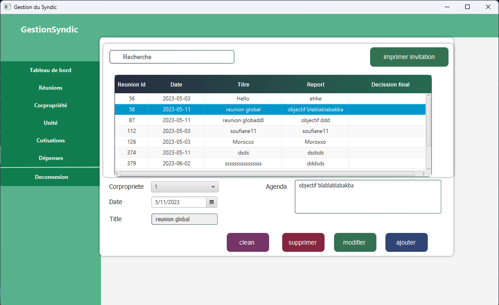

# Syndic management Tool 
It's a simple management Tool for syndic 
## Stack Used : 
    <ul>
        <li> Java FX </li>
        <li> Java </li>
        <li> Hibernate</li>
        <li> MySql</li>
    </ul>

## Use cases 
<ol>
    <li>Authentication</li>
    <li>contribution management </li>
    <li>expense management</li>
    <li>Export Invitation</li>
    <li>building management</li>
    <li>manage meetings</li>
    <li>manage units</li>
</ol>

## Authentication

## contribution management

## expense management

## building management

## manage meetings

## manage units
